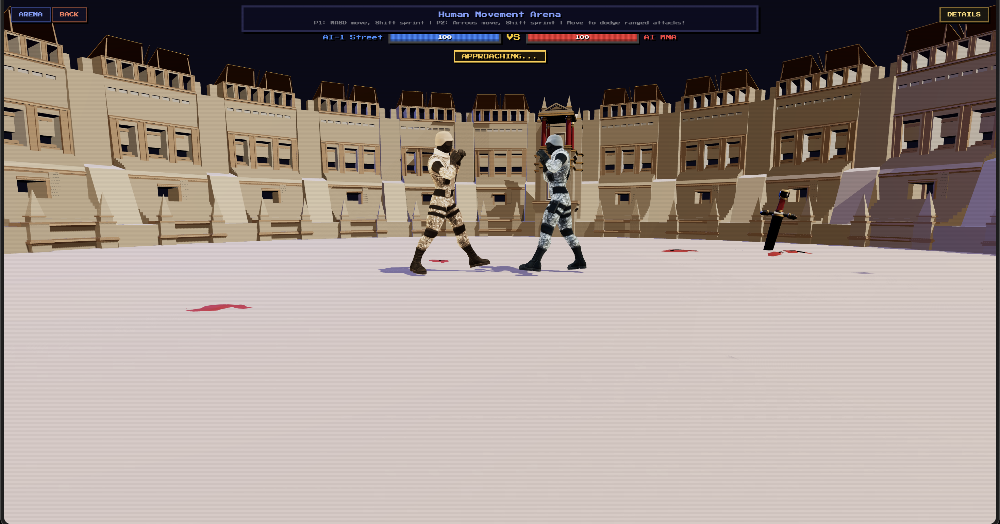
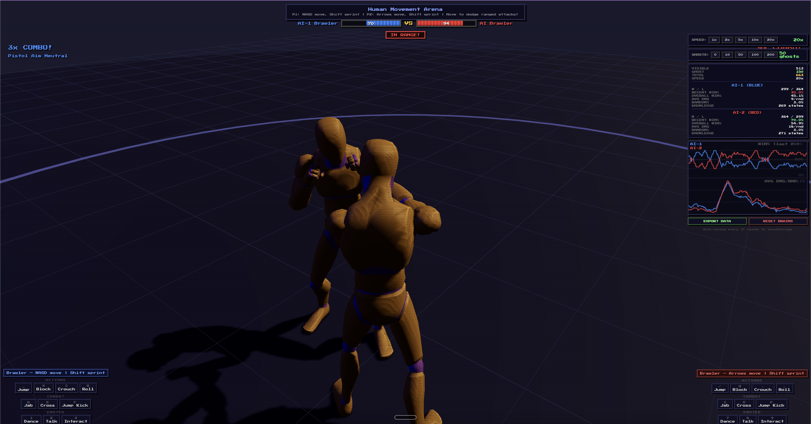

<div align="center">

# Human Movement Arena

**Browser-based 3D fighting game with real-time reinforcement learning**

[](https://ar9av.in/app/humanarena)
[](paper/human_movement_arena.pdf)
[](LICENSE)

Two AI agents learn to fight from scratch using tabular Q-learning in a real-time 3D environment.  
No neural networks. No GPU. No ML frameworks. Just a browser.



</div>

---

## What It Is

Human Movement Arena is a 3D fighting game where AI agents discover real combat strategies through reinforcement learning. Starting from random flailing, agents learn to attack, block, counter, and dodge by fighting thousands of rounds — all running in the browser with Three.js.

The project is also a research experiment investigating how **training fidelity** shapes learned behavior. Core finding: **185 rounds of real 3D training produced better fighters than 5,050 rounds of simplified headless simulation.**

<div align="center">
  
  <br />
  <em>AI agents in close combat, with live training dashboard visible</em>
</div>

---

## Game Modes

| Mode | Description |
|------|-------------|
| **1 Player vs AI** | Fight a pre-trained AI at one of four difficulty levels |
| **2 Players Local** | Two humans on the same keyboard |
| **AI vs AI Train** | Watch two Q-learning agents evolve in real time with full controls |
| **Animation Tester** | Trigger any of the 34 skeletal animations on either fighter |

---

## Controls

### Movement

| Action | Player 1 | Player 2 |
|--------|----------|----------|
| Move | `W` `A` `S` `D` | `↑` `↓` `←` `→` |
| Sprint (hold) | `Shift` | `Shift` |
| Block | `X` | `N` |
| Dodge Roll | `R` | `,` |

### Fighter Classes & Attack Keys

Each class has 8 attacks mapped to keys. Player 1 uses `Q E F Z T G Y H`, Player 2 uses `I O P K L J U M`.

| Class | Style | Walk Speed | Sprint Speed |
|-------|-------|-----------|-------------|
| **Boxer** | Lightning-fast punches, high combo potential | 2.6 | 4.2 |
| **MMA** | Close-combat specialist, elbows and spin kicks | 2.4 | 4.0 |
| **Street** | Raw power brawler, haymakers and combos | 2.3 | 3.8 |
| **Agent** | Tactical CQC, fastest class, counter-attacks | 3.0 | 4.8 |

### Debug

| Key | Function |
|-----|----------|
| `D` | Toggle bone debug spheres (wrist/hand positions) |

---

## Combat System

### Attack Definitions

Every attack has precise physical parameters that drive hit detection:

| Attack | Damage | Range | Hit Time | Type |
|--------|--------|-------|----------|------|
| Jab | 10 | 1.9 | 0.18s | Melee |
| Hook / Hook Right | 16 | 1.82 | 0.22s | Melee |
| Cross | 14 | 1.88 | 0.20s | Melee |
| Uppercut | 18 | 1.76 | 0.25s | Melee |
| Uppercut Combo | 22 | 1.78 | 0.28s | Melee |
| Body Shot (R/L) | 12 | 1.76 | 0.20s | Melee |
| Elbow | 14 | 1.64 | 0.15s | Melee (fastest) |
| Counter | 20 | 1.82 | 0.25s | Melee |
| Front Kick | 18 | 2.16 | 0.28s | Kick |
| Round Kick | 20 | 2.22 | 0.34s | Kick |
| MMA Spin Kick | 22 | 2.20 | 0.32s | Kick |
| Side Kick | 19 | 2.14 | 0.26s | Kick |

Kicks have longer range but melee attacks deal more reliable damage at close range. Each attack also has `idealDist`, `hitWindow`, `contactRadius`, and `forwardDot` (facing requirement), all used in hit resolution.

### Hit Resolution Pipeline

A hit lands only if all five checks pass:

1. **Attack is active** — `attackElapsed` is within `[hitTime, hitTime + hitWindow]`
2. **In range** — center-to-center distance `≤ atk.range`
3. **Victim not rolling** — `Roll` animation grants full invincibility
4. **Facing check** — attacker forward dot toward victim `≥ atk.forwardDot − slack`
5. **Contact check** — actual bone position (hand/foot) within `atk.contactRadius + slack` of victim's chest bone

### Blocking & Defense

- **Block** (`Block_Loop`) reduces damage to 15% chip damage and applies knockback
- Blocking while being hit prevents stun
- **Dodge Roll** grants complete invincibility for its duration
- **Movement evasion** — moving targets at range can dodge ranged-style hits

### Stun System

Taking a clean hit applies a stun of `0.3s + damage × 0.012s` (capped at 0.65s). During stun the player cannot act. Difficulty presets directly control this:

| Difficulty | Stun Duration | AI Decision Speed | AI Block Chance | AI Damage Mult |
|------------|-------------|-----------------|----------------|---------------|
| Easy | 0.60s | 0.15s | 5% | 0.7× |
| Medium | 0.35s | 0.10s | 10% | 1.0× |
| Hard | 0.15s | 0.07s | 25% | 1.2× |
| Expert | 0.05s | 0.05s | 40% | 1.4× |

---

## Reinforcement Learning

### Q-Learning Brain

Each AI has a tabular Q-table mapping `(state, action) → value`. No neural networks — the entire brain is a flat dictionary of `Float32Array` entries.

**State space** — 6-dimensional, encoded as a string key `dist_myHp_oppHp_oppAction_myAction_oppBlock`:

| Dimension | Bins | Meaning |
|-----------|------|---------|
| `dist` | 0=close (<1.5) · 1=mid (1.5–2.5) · 2=far (>2.5) | Fighter separation |
| `myHp` | 0=low (<30%) · 1=mid · 2=high (>60%) | Own health |
| `oppHp` | 0=low · 1=mid · 2=high | Opponent health |
| `oppAction` | 0=idle · 1=attacking · 2=stunned · 3=moving | What opponent is doing |
| `myAction` | 0=idle · 1=attacking · 2=blocking · 3=stunned | Own current state |
| `oppBlock` | 0=not blocking · 1=blocking | Opponent blocking |

Maximum possible states: 3 × 3 × 3 × 4 × 4 × 2 = **864 states**.

**Action space** — 7 discrete actions:

| Index | Action | Behavior |
|-------|--------|----------|
| 0 | `rush_attack` | Sprint toward opponent + attack when in range |
| 1 | `attack` | Attack now (step forward if needed) |
| 2 | `block` | Hold block for 0.25–0.4s |
| 3 | `advance` | Walk toward opponent |
| 4 | `roll` | Forward dodge roll |
| 5 | `counter` | Block then attack after a short delay |
| 6 | `retreat` | Step backward |

**Hyperparameters:**

```
Learning rate (α):    0.4
Discount factor (γ):  0.92
Initial epsilon:      0.15  (train mode minimum: 0.10)
Min epsilon:          0.03
Epsilon decay:        0.994 per round
Replay buffer size:   1000 experiences
Replay batch:         60 samples per round
```

**Initial Q-value bias** — new states are initialized with aggressive priors rather than zeros:

```
rush_attack: +2.0  |  attack: +3.0  |  block: -1.0
advance:     +1.0  |  roll:   +0.3  |  counter: +1.5  |  retreat: -1.0
```

This prevents the AI from learning a passive turtle strategy during early exploration.

### Reward Shaping

Rewards fire every 0.15s of game-time plus on discrete events:

| Situation | Reward |
|-----------|--------|
| Distance < 1.7 (contact range) | +2.0 |
| Distance 1.7–2.2 (mid range) | +0.5 |
| Distance > 3.0 (retreating) | −1.5 |
| Distance > 4.0 (far away) | −3.0 |
| Dealing damage | +damage × 1.5 |
| Hitting non-stunned opponent | +3.0 bonus |
| Taking damage | −damage × 0.8 |
| Taking damage while idle | −5.0 |
| Idle or blocking at close range | −3.0 or −2.0 |
| Active attack animation at close range | +1.5 |
| Landing a clean hit (event) | +damage × 0.5 |
| Taking a clean hit (event) | −damage × 0.3 |
| Blocking an attack (event) | −1 to attacker, −1 to victim |
| Dodging an attack (event) | −1 to attacker, +1 to victim |
| Winning the round | +50 |
| Losing the round | −50 |

### Experience Replay

After each round, 60 random experiences are replayed from a 1000-entry ring buffer at half the learning rate (α/2). This stabilizes learning and improves sample efficiency.

### AI Controller Logic

The `AIController` wraps the Brain with physical execution:

- **Decision loop** — every `decisionInterval` seconds, the brain picks an action from the Q-table
- **Movement** — executed frame-by-frame toward/away from opponent, never strafing
- **Attack positioning** — each attack has an `idealDist`; the AI walks to that exact range before swinging
- **Stagnation breaker** — if fighters are close and neither has dealt damage for 0.55s, forces an attack
- **Close pressure** — if the AI holds defense at close range for 0.42s with no threat, forces initiative
- **Reactive blocking** — when the opponent starts an attack within 2.2 units, the AI has a `aiBlockChance` probability of blocking and then counter-attacking

### Ghost Simulation (Headless Training)

Between every visible round, the game runs `N` headless "ghost fights" in the same JavaScript thread. Ghost fights use `GhostPlayer` (pure math, no Three.js) and the same `Brain` instances. This amplifies training signal without slowing the render loop.

Ghost differences from real fights:
- 1D positions only (fighters on a line, not a 3D arena)
- Start at 50% health so fights end faster (300 ticks max = 15s)
- No animation system — attack timing is approximate
- Moving-target dodge rate is 5% for melee (vs. real 3D where it's rare)

Ghost count is configurable: **0 / 10 / 50 / 100 / 200 ghosts per round**.

---

## Training Dashboard

When in Train mode a live dashboard shows:

- **Round count** (visible + ghost total)
- **Win rate** — rolling last-20 and cumulative for both AIs
- **Avg damage dealt** — rolling last-20 rounds
- **Exploration rate (ε)** — how random the AI is being
- **States explored** — how much of the 864-state space has been visited
- **Replay buffer size**
- **Win-rate graph** — canvas chart updated every round
- **Speed controls** — 0.85× / 1× / 2× / 5× / 10× / 20× simulation speed
- **Turbo mode** — runs multiple game ticks per render frame (1× / 5× / 10× / 20× / 50×)
- **Hyper mode** — skips rendering entirely, renders every ~500ms for progress only

### Persistence

Brains auto-save to `localStorage` every 10 visible rounds:
- `brain_p1` — AI-1's Q-table, stats, replay buffer
- `brain_p2` — AI-2's Q-table, stats, replay buffer
- `match_logs` — rolling buffer of last 5,000 match events

Refreshing the page resumes training from where it left off.

### Export

Clicking **EXPORT DATA** downloads a timestamped JSON file containing:
- Both full Q-tables
- Complete training stats and history
- All match event logs
- Ghost fight summaries (winner, damage, hit counts, fight length)

---

## Shipped AI Brain

The `1P vs AI` mode loads `assets/trained_brain_p2.json` — a pre-trained Q-table shipped with the game. It bypasses localStorage (which may contain in-progress training data) to guarantee consistent difficulty behavior. Difficulty levels modify the loaded brain's epsilon at runtime.

---

## Architecture

```
human-fight-rl-main/
├── index.html               HTML shell — all screens are divs, JS drives visibility
├── css/style.css            Retro pixel-art UI (Press Start 2P font)
├── js/
│   ├── main.js              Boot, game loop, KO handling, training orchestration
│   ├── scene.js             Three.js scene, camera, lighting, arena GLB loader
│   ├── player.js            Player class — animation system, movement, hit detection bones
│   ├── combat.js            Attack definitions, hit resolution (range/facing/bone contact)
│   ├── controls.js          Keyboard input → player movement + attack dispatch
│   ├── classes.js           Fighter class definitions, attack sets, keybind generation
│   ├── ai.js                AI controller — brain integration, movement, attack execution
│   ├── brain.js             Q-learning — Q-table, state encoding, replay buffer, persistence
│   ├── difficulty.js        Difficulty presets (Easy / Medium / Hard / Expert)
│   ├── headless.js          Headless 1D ghost simulator for accelerated training
│   ├── logger.js            Per-frame match event logger (JSON export)
│   ├── sfx.js               Web Audio API sound effects
│   └── ui.js                DOM updates — health bars, HUD, panels, training stats
├── assets/
│   ├── character.glb        Rigged 3D character with 34+ skeletal animations
│   ├── arena.glb            3D arena environment
│   └── trained_brain_p2.json Pre-trained Q-table shipped for 1P mode
└── paper/
    ├── human_movement_arena.pdf  Research paper
    └── figures/                  Data-driven charts (matplotlib)
```

### Key Data Flow

```
User Input / AI Brain
        ↓
   controls.js / ai.js
        ↓  (play animation)
    player.js
        ↓  (animation name + elapsed time)
    combat.js  (checkAttackHit)
        ↓  (hit/block/dodge result)
    main.js  (resolveHit)
        ↓  (reward signal)
    brain.js  (learn / replay)
```

### Animation System

Logical animation names (e.g. `Kick_Round`) are mapped to GLB clip names (e.g. `Round Kick`) through `ANIM_MAP` in `player.js`. Per-animation playback speed multipliers make punches feel snappy:

- Jab: 1.28× | Elbow: 1.22× | Cross: 1.2× | Hook: 1.16× | Roll: 1.35×

One-shot animations (attacks, reactions, death, roll) fire once and return to `Idle_Loop`. Looping animations (idle, walk, block) run until replaced.

Root motion is stripped from all animation clips at load time so the physics system controls character position exclusively.

---

## Research Findings

The project systematically compared three training approaches:

| Approach | Rounds | Outcome |
|----------|--------|---------|
| Naive ghost simulation | 5,050 | Failed — damage collapsed to near zero, strategies useless in 3D |
| Calibrated ghost simulation | 1,734 | Improved but 96% fights timed out; strategies did not transfer |
| **Pure 3D training** | **185** | **Best results — stable damage, competitive against human players** |

**Five reward function failure modes were documented:**

| Failure | Symptom |
|---------|---------|
| Idle Agent | AI stood still 44% of time when getting hit |
| Mutual Avoidance | Both AIs stayed apart — 99% match timeouts |
| Damage Collapse | Average damage per round dropped from 196 → 16 |
| Block Turtling | AI held block for 94% of the match |
| HP Blindness | Training at 10% HP hit only 41 of 864 possible states |

**Human player evaluation (n=8 matches):**

| Training Stage | Record vs Human | AI Accuracy | AI Idle When Hit |
|----------------|-----------------|-------------|-----------------|
| Untrained | Human 5–0 | 65% | 44% |
| After ghost training | Human 2–0 | 50% | 8% |
| After pure 3D training | **Human 2–1** | **100%** | **0%** |

Full methodology and analysis in the [research paper](paper/human_movement_arena.pdf).

---

## Quick Start

```bash
# Clone
git clone https://github.com/Ar9av/human-fight.git
cd human-fight

# Serve (any static HTTP server)
python3 -m http.server 8080

# Open in browser
open http://localhost:8080
```

No build step. No npm install. No dependencies beyond the CDN-loaded Three.js.

> **Note:** Must be served over HTTP (not `file://`) because ES modules require a server context.

---

## Tech Stack

| Layer | Technology |
|-------|------------|
| 3D rendering | [Three.js r162](https://threejs.org/) via CDN import map |
| 3D models | GLB/glTF (Fantacode Melee Combat System animations) |
| Reinforcement learning | Custom tabular Q-learning, no ML libraries |
| Language | Vanilla ES2022 modules, no bundler |
| Persistence | `localStorage` (Q-tables + match logs) |
| Audio | Web Audio API (procedural sound effects) |
| Deployment | Any static host (DigitalOcean App Platform config in `.do/app.yaml`) |

---

## License

MIT

---

<div align="center">
  <strong><a href="https://ar9av.in/app/humanarena">Play Human Movement Arena</a></strong><br/>
  Built by <a href="https://github.com/Ar9av">Arnav Gupta</a>
</div>
